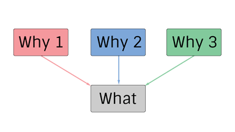
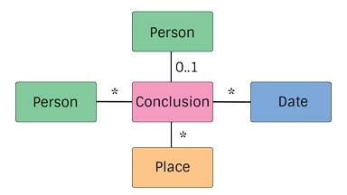

# pTree
A Genealogical Data Model specification on top of [vGraph](https://github.com/genealogysystems/vgraph).

**Current Version:** 0.1.0-pre-alpha

# Semantic Versioning
This document follows Semantic Versioning 2.0.0 as found [here](http://semver.org/).

# 2 Parts
// TODO explanation of "What" and "Why"

# A Note on Scoping
vGraph Labels are used to "type" each node and edge.
As such, they must be unique within the pTree namespace.
Also, subtyping is accomplished with a common prefix, like `name_part`. // TODO change example to one that actually occurs.

# Why

# What
This models what is/was.
// TODO more explanation

Note that each of these boxes could be a subgraph.
Also note that the edges connecting the various pieces can contain properties.
Also note that the conclusion contains the edges going to Person, Place, and Date.

## Person
A Person within the model.

[spec](spec/person.md)

## Conclusion
Some piece of data associated with a Person. It may be an Event, a Fact, a Relationship, etc...
Note that you will never see an actual "conclusion" label, as this is akin to an abstract type.
An Event is an instance of a conclusion.
Conclusion is an abstraction that allows us to talk about the Events/Facts/Relationship things in a general sense.

[spec](spec/conclusion.md)

## Date
A Representation of a date (approximate or specific) or date range.

[spec](spec/date.md)

## Place
A place somewhere on planet earth (for now).

[spec](spec/place.md)