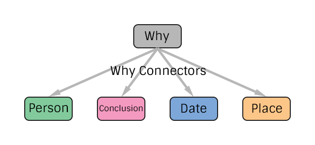

# pTree
A Genealogical Data Model specification on top of [vGraph](https://github.com/genealogysystems/vgraph).

# Current Version - 0.1.0-pre-alpha
This document follows Semantic Versioning 2.0.0 as found [here](http://semver.org/).

# 2 Parts
pTree splits its data into two parts, the What and the Why, and connects these together with a standard interface. It also allows multiple Whys, or research processes/methodologies, to coexist through namespacing.

In the image above you can see 3 "Whys", all different colors. Each color represents a different "Why Model", and they are all pointing to the same "What".

You will also notice that the pointers from each "Why" are the same color as the "Why". This is because each pointer is scoped to the "Why" and the "Why Model" it represents.

# What

This is the basic diagram of how things are organized at the What level. In it we are Person-centric, with Conclusions being associated with a Person, Dates, Places, and other Persons.

Note that each of these boxes could be a subgraph.
Also note that the edges connecting the various pieces can contain properties.
Also note that the conclusion contains the edges going to Person, Place, and Date.

### Person
A Person within the model.

[spec](spec/person.md)

### Conclusion
Some piece of data associated with a Person. It may be an Event, a Fact, a Relationship, etc...
Note that you will never see an actual "conclusion" label, as this is akin to an abstract type.
An Event is an instance of a conclusion.
Conclusion is an abstraction that allows us to talk about the Events/Facts/Relationship things in a general sense.

[spec](spec/conclusion.md)

### Date
A Representation of a date (approximate or specific) or date range.

[spec](spec/date.md)

### Place
A place somewhere on planet earth (for now).

[spec](spec/place.md)

# Why
The representation of the research process used.
There are many different research processes, each with its own set of nodes and edges.
Each particular Why, or research process, is namespaced such that it does not interfere with anything else.
Additionally, each Why implementation connects to various Whats (person, conclusion, place, date) using Why Connectors (see below).

### List of Implementations

* [Note](spec/note.md) - The simplest implementation.

# Why Connector

The connection between Whys and Whats is accomplished through an Edge labeled `Why`.

[spec](spec/why.md)

# A Note on Scoping
vGraph Labels are used to "type" each node and edge.
As such, they must be unique within the pTree namespace.
Also, subtyping is accomplished with a common prefix, like `name_part`. // TODO change example to one that actually occurs.