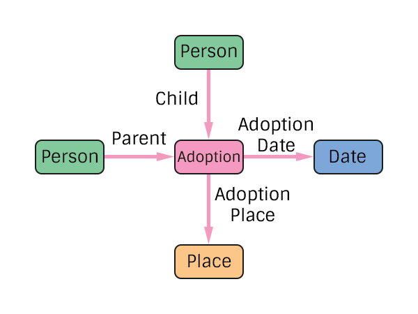

# Adoption Specification
The representation of an adoption in the pTree Model.

Note that no Gender restrictions have been added at the specification level. Historical integrity checks should be added at the application level.

Note that an adoption represents the adoption of one child to N parents.

## TODO
> Consider adding the ability to track jurisdiction or other info. Maybe this is inherent in Place?
> What other information is missing?

# Construction

# Restrictions
* Only one child per adoption.
* Only one date per adoption.
* Only one place per adoption.

# Nodes

### Adoption

**Label** `Adoption`

**Properties**
`None`

# Edges

### Child

**Label** `Adoption_Child_Ref`

**From** `Person`

**To** `Adoption`

**Properties**
`None`

### Parent

**Label** `Adoption_Parent_Ref`

**From** `Person`

**To** `Adoption`

**Properties**
`None`

### Adoption Date

**Label** `Adoption_Date_Ref`

**From** `Adoption`

**To** `Date`

**Properties**
`None`

### Adoption Place

**Label** `Adoption_Place_Ref`

**From** `Adoption`

**To** `Place`

**Properties**
`None`