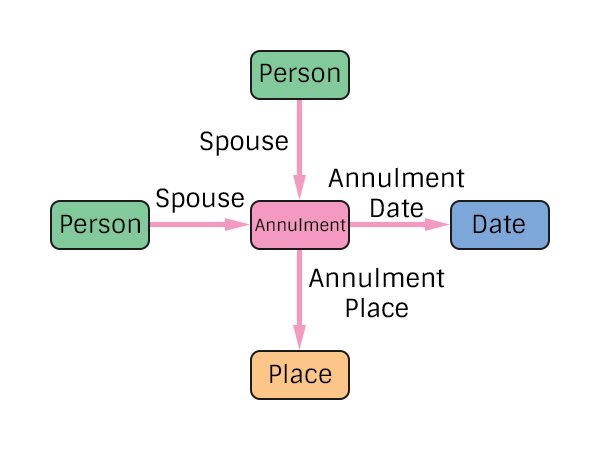

# Annulment Specification
The representation of an annulment in the pTree Model.

Note that no Gender restrictions have been added at the specification level. Historical integrity checks should be added at the application level.

## TODO
> What other data needs to be tracked?

# Construction

# Restrictions
* Only one date per annulment.
* Only one place per annulment.

Note: The existence of a marriage and later annulment between 2 spouses is linked by the 2 spouses being the same.

# Nodes

### Annulment

**Label** `Annulment`

**Properties**
`None`

# Edges

### Spouse

**Label** `Annulment_Spouse_Ref`

**From** `Person`

**To** `Annulment`

**Properties**
`None`

### Annulment Date

**Label** `Annulment_Date_Ref`

**From** `Annulment`

**To** `Date`

**Properties**
`None`

### Annulment Place

**Label** `Annulment_Place_Ref`

**From** `Annulment`

**To** `Place`

**Properties**
`None`