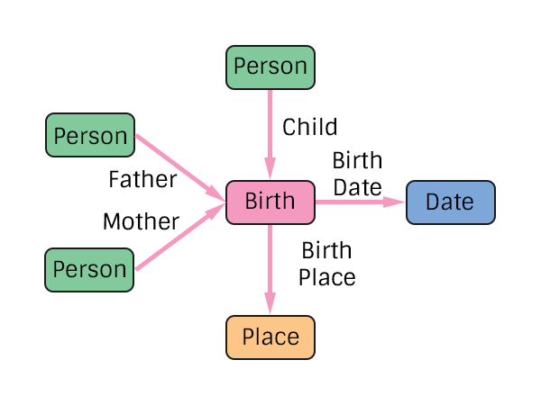

# Birth Specification
The representation of a person's birth in the pTree Model.

Note that the father and mother are BIOLOGICAL father and mother. There are other types for adoption, foster, etc.

## TODO
> Add additional edge types for people present at the birth
> Consider how to handle stillborn birth (property on Birth?)

# Construction

# Restrictions
* Only one child per birth.
* Only one date per birth.
* Only one place per birth. 

# Nodes

### Birth

**Label** `Birth`

**Properties**
`None`

# Edges

### Child Reference

**Label** `Birth_Child_Ref`

**From** `Person`

**To** `Birth`

**Properties**
`None`

### Mother Reference

**Label** `Birth_Mother_Ref`

**From** `Person`

**To** `Birth`

**Properties**
`None`

### Father Reference

**Label** `Birth_Father_Ref`

**From** `Person`

**To** `Birth`

**Properties**
`None`

### Birth Date

**Label** `Marriage_Date_Ref`

**From** `Birth`

**To** `Date`

**Properties**
`None`

### Birth Place

**Label** `Marriage_Place_Ref`

**From** `Birth`

**To** `Place`

**Properties**
`None`