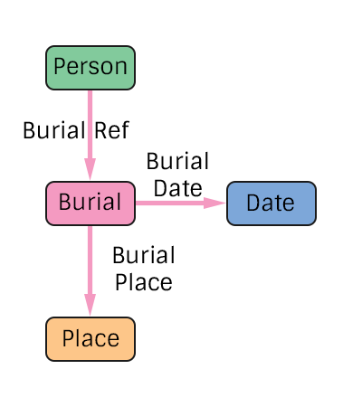

# Burial Specification
The representation of a person's burial in the pTree Model.

## TODO
> Add additional edge types for people present at the burial.

# Construction

# Restrictions
* Only one date per burial.
* Only one place per burial. 

# Nodes

### Burial

**Label** `Burial`

**Properties**
`None`

# Edges

### Burial Reference

**Label** `Burial_Ref`

**From** `Person`

**To** `Burial`

**Properties**
`None`

### Burial Date

**Label** `Burial_Date_Ref`

**From** `Burial`

**To** `Date`

**Properties**
`None`

### Burial Place

**Label** `Burial_Place_Ref`

**From** `Burial`

**To** `Place`

**Properties**
`None`