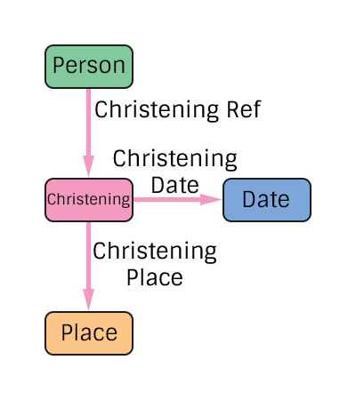

# Christening Specification
The representation of a person's christening in the pTree Model.

## TODO
> Add additional edge types for people present at the christening.

# Construction

# Restrictions
* Only one date per christening.
* Only one place per christening. 

# Nodes

### Christening

**Label** `Christening`

**Properties**
`None`

# Edges

### Christening Reference

**Label** `Christening_Ref`

**From** `Person`

**To** `Christening`

**Properties**
`None`

### Christening Date

**Label** `Christening_Date_Ref`

**From** `Christening`

**To** `Date`

**Properties**
`None`

### Christening Place

**Label** `Christening_Place_Ref`

**From** `Christening`

**To** `Place`

**Properties**
`None`