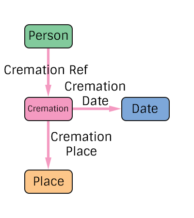

# Cremation Specification
The representation of a person's cremation in the pTree Model.

## TODO
> Add additional edge types for people present at the cremation.

# Construction

# Restrictions
* Only one date per cremation.
* Only one place per cremation. 

# Nodes

### Cremation

**Label** `Cremation`

**Properties**
`None`

# Edges

### Cremation Reference

**Label** `Cremation_Ref`

**From** `Person`

**To** `Cremation`

**Properties**
`None`

### Cremation Date

**Label** `Cremation_Date_Ref`

**From** `Cremation`

**To** `Date`

**Properties**
`None`

### Cremation Place

**Label** `Cremation_Place_Ref`

**From** `Cremation`

**To** `Place`

**Properties**
`None`