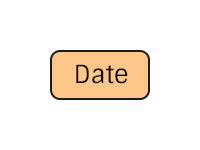

# Date Specification
The representation of a date in the pTree model

# TODO

> Consider how to handle dates outside of the GEDCOMX spec.

# Construction

# Restrictions
`None`

# Nodes

### Date

**Label** `Date`

**Properties**

* `original`(String) - The original date string.
* `formal`(String) - The normalized/standardized date string. Follows [GEDCOMX spec](https://github.com/FamilySearch/gedcomx/blob/master/specifications/date-format-specification.md).

# Edges
`None`