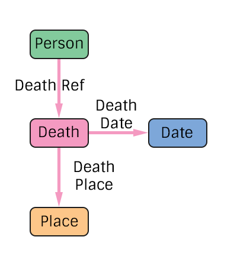

# Death Specification
The representation of a person's death in the pTree Model.

## TODO
> Add additional edge types for people present at the death.

# Construction

# Restrictions
* Only one date per death.
* Only one place per death. 

# Nodes

### Death

**Label** `Death`

**Properties**
`None`

# Edges

### Death Reference

**Label** `Death_Ref`

**From** `Person`

**To** `Death`

**Properties**
`None`

### Death Date

**Label** `Death_Date_Ref`

**From** `Death`

**To** `Date`

**Properties**
`None`

### Death Place

**Label** `Death_Place_Ref`

**From** `Death`

**To** `Place`

**Properties**
`None`