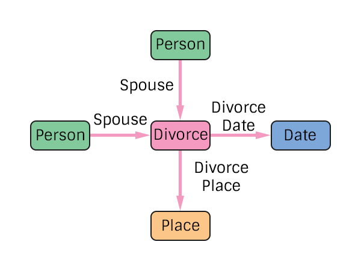

# Divorce Specification
The representation of an divorce in the pTree Model.

Note that no Gender restrictions have been added at the specification level. Historical integrity checks should be added at the application level.

## TODO
> What other data needs to be tracked?

# Construction

# Restrictions
* Only one date per divorce.
* Only one place per divorce.

Note: The existence of a marriage and later divorce between 2 spouses is linked by the 2 spouses being the same.

# Nodes

### Divorce

**Label** `Divorce`

**Properties**
`None`

# Edges

### Spouse

**Label** `Divorce_Spouse_Ref`

**From** `Person`

**To** `Divorce`

**Properties**
`None`

### Divorce Date

**Label** `Divorce_Date_Ref`

**From** `Divorce`

**To** `Date`

**Properties**
`None`

### Divorce Place

**Label** `Divorce_Place_Ref`

**From** `Divorce`

**To** `Place`

**Properties**
`None`