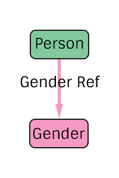

# Gender Specification
The representation of a person's gender in the pTree Model.

## TODO
> Consider how to handle a sex change.
> Possibly add an optional `gender_change` edge (with from and to properties) going from Gender to a Date.
> May also need to add an optional property to Gender_Ref specifying which is the "Primary" gender.

# Construction

# Nodes

## Gender

**Label** `Gender`

**Properties**

* `value`(String) - The value of the gender. Must be one of `Male`, `Female`, or `Unknown`.

# Edges

## Gender Reference

**Label** `Gender_Ref`

**From** `Person`

**To** `Gender`

**Properties**
`None`