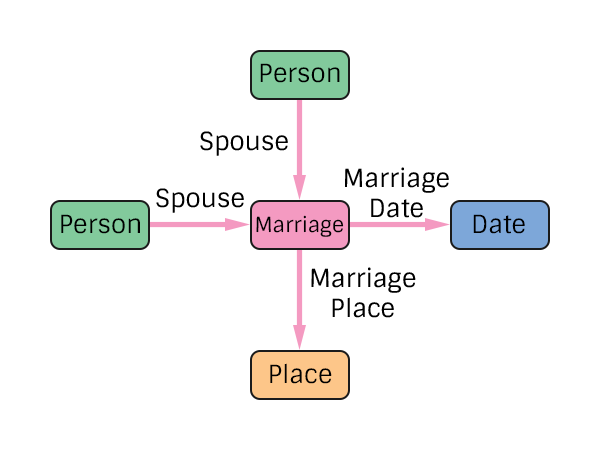

# Marriage Specification
The representation of a marriage in the pTree Model.

Note that no Gender restrictions have been added at the specification level. Historical integrity checks should be added at the application level.

## TODO
> Consider adding additional edge labels to handle guests and other roles (best man, etc.).
> Consider adding a property to handle marriage vs. common law marriage.

# Construction

# Restrictions
* Only one date per marriage.
* Only one place per marriage.
* A maximum of 2 spouses.

Note: The reason 2 spouses are not required is that you may only know one of them, which is perfectly fine.

# Nodes

### Marriage

**Label** `Marriage`

**Properties**
`None`

# Edges

### Spouse

**Label** `Marriage_Spouse_Ref`

**From** `Person`

**To** `Marriage`

**Properties**
`None`

### Marriage Date

**Label** `Marriage_Date_Ref`

**From** `Marriage`

**To** `Date`

**Properties**
`None`

### Marriage Place

**Label** `Marriage_Place_Ref`

**From** `Marriage`

**To** `Place`

**Properties**
`None`
