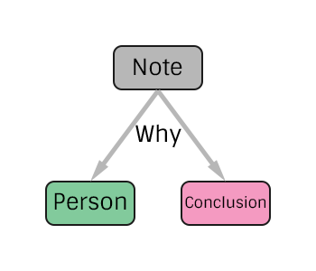

# Note Specification
The simplest of Whys, an attached note!

# TODO
> Add language
> Maybe add subject?
> What about attribution? commit author vs external attribution
> Timestamp of somesort? Or handle via node creation?

# Construction

# Nodes

### Note

**Label** `Note`

**Properties**
* `type`(String) - The type of the Value. One of `text` or `html`.
* `value`(String) - The note's value, stored as text.

# Edges
`None`

# Why Connector

**Additional Properties**
`None`