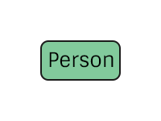

# Person Specification
The representation of a person in the pTree Model.

# TODO
> Consider linking a person to a person in another program (Ancestry, etc.).
> Maybe implement as a property (or set of properties)?

# Construction

# Nodes

## Person

**Label** `Person`

**Properties**
`None`

# Edges
`None`