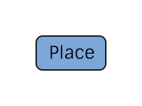

# Place Specification
The representation of a place in the pTree model

# TODO

> A single field for the original place string is sufficient as long as there is a way to associate it with a place standard.
> There are two ways to accomplish this.
> The first is to allow for a URI that points or resolves to a place standard.
> The second is to create a "Standard Place" object in pTree and associate a Place (using an edge) with a "Standard Place".
> This would allow the preservation of the original string, and allow it to be changed without changing the "Standard Place".
> Maybe if there was a central vGraph/Trepo instance that contained a standard place model (that everyone could contribute to) that people could link to using boundary nodes.

# Construction

# Restrictions
`None`

# Nodes

### Place

**Label** `Place`

**Properties**

* `original`(String) - The original place string (fully qualified).

# Edges
`None`